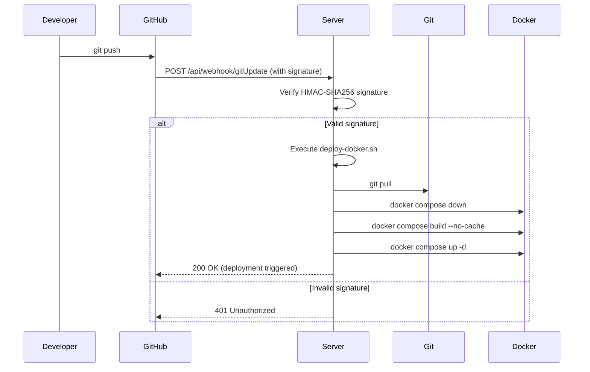

# FlowSynth Docker Deployment Guide

This guide covers deploying the FlowSynth frontend using Docker.

Note: The previous backend/webhook deployment flow has been removed; this repository now ships a frontend-only container.

## 🚀 Quick Start

### Prerequisites

- Docker & Docker Compose installed

Optional (production): a reverse proxy (Apache2/nginx) for SSL termination.

### Initial Setup

1. **Clone the repository**
   ```bash
   git clone https://github.com/k1ln/flowSynth.git
   cd flowSynth
   ```

2. **Build and start containers**
   ```bash
   docker compose up -d --build
   ```

3. **Verify deployment**
   ```bash
   # Check container status
   docker compose ps
   
   # Check logs
   docker compose logs -f

   # Test frontend (compose binds to localhost:1337)
   curl http://localhost:1337/
   ```

## 🌐 Apache2 Reverse Proxy Setup (Optional)

If you have an existing Apache2 web server with SSL certificates, you can use it as a reverse proxy:

**Quick Setup:**
```bash
cd apache2-config
chmod +x apache2-setup.sh
sudo bash apache2-setup.sh
```

This configures Apache2 to:
- Handle SSL/TLS termination (HTTPS)
- Proxy requests to Docker containers on localhost
- Serve both synflow.org and 1ln.de (or your domains)
- Support GitHub webhooks through your domain

**Ports with a reverse proxy:**
- Frontend container: `127.0.0.1:1337` (internal only)
- Reverse proxy: ports 80 & 443 (public HTTPS)

See **`apache2-config/README.md`** for complete Apache2 setup documentation.

## 🔐 GitHub Webhook Configuration (Legacy)

Webhook-based auto-deploy required the removed backend service and is no longer applicable in the frontend-only setup.

### 1. Configure the Webhook in GitHub

1. Go to your repository on GitHub
2. Navigate to **Settings** → **Webhooks** → **Add webhook**
3. Configure:
   - **Payload URL**: `https://your-domain.com/api/webhook/gitUpdate`
     - With Apache2: `https://synflow.org/api/webhook/gitUpdate` or `https://1ln.de/api/webhook/gitUpdate`
     - Without Apache2: `https://your-server-ip:4000/api/webhook/gitUpdate`
   - **Content type**: `application/json`
   - **Secret**: Enter the `WEBHOOK_SECRET` value from your `.env` file
   - **Which events**: Select "Just the push event"
   - **Active**: ✅ Check this box
4. Click **Add webhook**

### 2. Security Notes

⚠️ **CRITICAL SECURITY REQUIREMENTS:**

- **NEVER commit `.env` file** - it's already in `.gitignore`
- **Use strong secrets** - minimum 32 characters, cryptographically random
- **HTTPS required in production** - webhook signatures are sent over the network
- **Keep secrets separate** - GitHub webhook secret ≠ JWT secret
- The webhook secret is **only stored in your server's `.env`** file
- GitHub **only stores a hash** of the secret, not the plaintext
- Even if your repository is public, the webhook secret remains private

### 3. How It Works



## 📁 File Structure

```
flowSynth/
├── docker-compose.yml          # Container orchestration
├── Dockerfile                  # Frontend build & nginx config
├── nginx.conf                  # Nginx configuration for SPA
├── deploy-docker.sh            # Automated deployment script
├── .env.example                # Environment template
├── .env                        # Your secrets (NOT committed)
├── backend/
│   ├── Dockerfile              # Backend build
│   └── src/
│       └── routes/
│           └── webhook.ts      # GitHub webhook handler
└── README.DEPLOYMENT.md        # This file
```

## 🛠️ Manual Operations

### View Logs
```bash
# All services
docker compose logs -f

# Backend only
docker compose logs -f backend

# Frontend only
docker compose logs -f frontend
```

### Restart Services
```bash
# Restart all
docker compose restart

# Restart backend only
docker compose restart backend
```

### Manual Deployment
```bash
# Pull latest code
git pull origin main

# Rebuild and restart
docker compose down
docker compose up -d --build
```

### Access Container Shell
```bash
# Backend
docker compose exec backend sh

# Frontend
docker compose exec frontend sh
```

## 🔍 Troubleshooting

### Webhook Not Triggering

1. **Check webhook health endpoint:**
   ```bash
   curl https://your-domain.com/api/webhook/gitUpdate/health
   ```

2. **Check GitHub webhook delivery logs:**
   - Go to Settings → Webhooks → Your webhook
   - Click "Recent Deliveries"
   - Check response status and body

3. **Verify signature in backend logs:**
   ```bash
   docker compose logs backend | grep webhook
   ```

### Container Won't Start

1. **Check environment variables:**
   ```bash
   docker compose config
   ```

2. **Check resource usage:**
   ```bash
   docker stats
   ```

3. **Rebuild without cache:**
   ```bash
   docker compose build --no-cache
   docker compose up -d
   ```

### Database Issues

The SQLite database is stored in `backend/data/`. To reset:
```bash
docker compose down
rm -rf backend/data/*.db
docker compose up -d
```

To override the location, set `DB_FILE` in `.env` (for example `DB_FILE=data/flowsynth.db`). The Docker entrypoint now auto-creates the parent directory inside the backend container, so the service starts cleanly even when pointing at a custom path. Mount the same directory as a volume if you need persistence across rebuilds, e.g. `./backend/data:/app/backend/data`.

## 🔒 Production Hardening

### 1. Use HTTPS

Update `docker-compose.yml` to add reverse proxy with SSL:
```yaml
services:
  nginx-proxy:
    image: nginx:alpine
    ports:
      - "80:80"
      - "443:443"
    volumes:
      - /etc/letsencrypt:/etc/letsencrypt:ro
      - ./nginx-proxy.conf:/etc/nginx/nginx.conf:ro
```

### 2. Rate Limiting

Add rate limiting to webhook endpoint (in nginx or application):
```nginx
limit_req_zone $binary_remote_addr zone=webhook:10m rate=5r/m;

location /api/webhook/ {
    limit_req zone=webhook burst=2;
    proxy_pass http://backend:4000;
}
```

### 3. Firewall Rules

Only allow webhook access from GitHub's IP ranges:
```bash
# Get GitHub's webhook IPs
curl https://api.github.com/meta | jq .hooks

# Configure firewall (example with ufw)
ufw allow from <github-ip>/32 to any port 443
```

### 4. Logging and Monitoring

Enable centralized logging:
```yaml
services:
  backend:
    logging:
      driver: "json-file"
      options:
        max-size: "10m"
        max-file: "3"
```

### 5. Resource Limits

Add resource constraints:
```yaml
services:
  backend:
    deploy:
      resources:
        limits:
          cpus: '1.0'
          memory: 512M
        reservations:
          cpus: '0.5'
          memory: 256M
```

## 📊 Monitoring

### Health Checks

Built-in health checks in `docker-compose.yml`:
- Backend: `http://localhost:4000/api/health`
- Frontend: `http://localhost/health`
- Webhook: `http://localhost:4000/api/webhook/gitUpdate/health`

### Deployment Logs

Check deployment logs:
```bash
# On the server
tail -f /var/log/flowsynth-deploy.log
```

## 🔄 Update Workflow

1. **Developer pushes to main branch**
2. **GitHub sends webhook** with HMAC-SHA256 signature
3. **Backend verifies signature** using `WEBHOOK_SECRET`
4. **If valid**, triggers `deploy-docker.sh` in background
5. **Script pulls latest code**, rebuilds containers, restarts services
6. **Health checks verify** deployment success

## 🆘 Emergency Rollback

If a deployment breaks:

```bash
# Rollback git
git log --oneline  # Find last good commit
git reset --hard <commit-hash>

# Rebuild
docker compose down
docker compose up -d --build
```

## 📝 Environment Variables Reference

| Variable | Required | Description | Example |
|----------|----------|-------------|---------|
| `JWT_SECRET` | Yes | Secret for JWT token signing | `openssl rand -base64 32` |
| `WEBHOOK_SECRET` | Yes | GitHub webhook verification secret | `openssl rand -hex 32` |
| `NODE_ENV` | No | Node environment (default: production) | `production` |
| `PORT` | No | Backend port (default: 4000) | `4000` |
| `DB_FILE` | No | SQLite database file path (relative paths resolve under `/app`) | `data/flowsynth.db` |

## 🧪 Testing the Webhook

Test the webhook manually:

```bash
# Generate test signature
SECRET="your-webhook-secret"
PAYLOAD='{"ref":"refs/heads/main","repository":{"full_name":"k1ln/flowSynth"}}'
SIGNATURE=$(echo -n "$PAYLOAD" | openssl dgst -sha256 -hmac "$SECRET" | sed 's/^.* //')

# Send test request
curl -X POST https://your-domain.com/api/webhook/gitUpdate \
  -H "Content-Type: application/json" \
  -H "X-GitHub-Event: push" \
  -H "X-Hub-Signature-256: sha256=$SIGNATURE" \
  -d "$PAYLOAD"
```

Expected response:
```json
{
  "success": true,
  "message": "Deployment triggered",
  "repository": "k1ln/flowSynth",
  "ref": "refs/heads/main",
  "timestamp": "2025-10-25T12:34:56.789Z"
}
```

## 📚 Additional Resources

- [Docker Compose Documentation](https://docs.docker.com/compose/)
- [GitHub Webhooks Guide](https://docs.github.com/en/developers/webhooks-and-events/webhooks)
- [Securing Webhooks](https://docs.github.com/en/developers/webhooks-and-events/webhooks/securing-your-webhooks)
- [Node.js Docker Best Practices](https://github.com/nodejs/docker-node/blob/main/docs/BestPractices.md)

## 🤝 Contributing

When adding new environment variables:
1. Add to `.env.example` with description
2. Update this README
3. Never commit actual `.env` file

---

**Need help?** Open an issue on GitHub or check the deployment logs.
