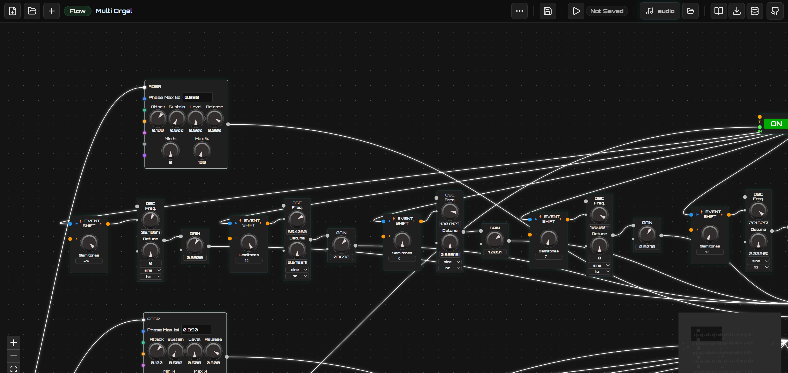
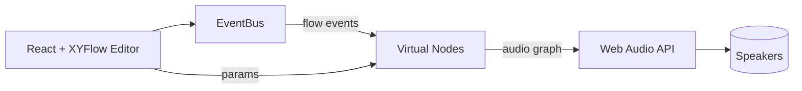

```
███████╗██╗   ██╗███╗   ██╗███████╗██╗      ██████╗ ██╗    ██╗
██╔════╝╚██╗ ██╔╝████╗  ██║██╔════╝██║     ██╔═══██╗██║    ██║
███████╗ ╚████╔╝ ██╔██╗ ██║█████╗  ██║     ██║   ██║██║ █╗ ██║
╚════██║  ╚██╔╝  ██║╚██╗██║██╔══╝  ██║     ██║   ██║██║███╗██║
███████║   ██║   ██║ ╚████║██║     ███████╗╚██████╔╝╚███╔███╔╝
╚══════╝   ╚═╝   ╚═╝  ╚═══╝╚═╝     ╚══════╝ ╚═════╝  ╚══╝╚══╝ 
```

<p>
  
  
  
  
</p>

<p >
  
</p>

Synflow is a browser-based, node-graph workstation for building interactive audio, MIDI, and control flows. It combines a modular synth feel with a visual editor powered by @xyflow/react, React 19, and the Web Audio API. Patch oscillators, filters, FX, MIDI utilities, and flow-event processors together to prototype ideas fast—entirely in the browser.

---

## ✨ Highlights
- Visual node editor with draggable handles and live previews in the docs playground
- Hybrid signal graph: audio-rate processing plus flow-event/control streams
- Web Audio building blocks: oscillators, filters, dynamics, delay/reverb, distortion, frequency shifters, analyzers
- MIDI & control: MIDI buttons/knobs, sequencing, clocks, automation, frequency utilities
- AudioWorklet-powered processors for low-latency tasks (e.g., frequency shifting)
- Documentation playground that mirrors real node handles, defaults, and behaviors

### What you can build
- Modular synth patches and FX chains
- MIDI-driven instruments and utilities
- Interactive audio toys, procedural soundbeds, and experimental processors

---
<p>
  
</p>
---
## 🖼️ Architecture at a glance


- **UI**: React + XYFlow renders nodes, handles, and the docs playground previews.
- **EventBus**: Routes flow-event/control messages between nodes and virtual processors.
- **Virtual Nodes**: Manage Web Audio graphs (e.g., BiquadFilter chains, AudioWorklet processors).
- **Web Audio**: Core audio engine for oscillators, filters, EQ, dynamics, and custom processors.

---

## 🚀 Quick start (dev)
```bash
npm install
npm run dev
```
- Open the printed local URL (default Vite dev server) and start patching.
- Try the docs playground to see node previews and handle layouts before adding them to a graph.

### Useful scripts
- `npm run dev` — Start Vite dev server
- `npm run build` — Production build
- `npm test` — Run unit tests (Vitest)

---

## 📖 Node catalog (full list)

- Master Out — final bus, meters/volume out
- Oscillator — basic audio osc (waveform, detune, freq)
- AudioWorklet Oscillator — osc with worklet-backed FM/sync inputs
- Flow Node (Subgraph) — encapsulated subgraph entry
- Biquad Filter — low/high/band filters with Q/gain
- Dynamic Compressor — threshold/knee/ratio/attack/release
- Gain Node — simple gain/attenuation
- Delay — tempo-free delay line
- Reverb — simple reverb tail
- Distortion — presets/formula-based drive
- AudioWorklet Processor — generic worklet node wrapper
- IIR Filter — feedforward/feedback filter
- ADSR Envelope — attack/decay/sustain/release generator
- Button — UI trigger
- MIDI Button — button with MIDI learn
- On/Off Button — latching toggle
- Clock — BPM clock emitter
- Frequency — freq utility (Hz/MIDI/LFO)
- Constant — static value source
- Switch — route-selecting switch
- Blocking Switch — gated switch variant
- Function — custom JS function node
- Input (Bus) — named bus input
- Output (Bus) — named bus output
- Sample Player — triggerable sample output
- MIDI Flow Note — MIDI note source
- Sequencer — trigger sequencer
- Sequencer (Frequency) — pitch/frequency sequencer
- Automation — curve-based automation
- Analyzer (GPT) — audio analyzer display
- Log — log flow values
- MIDI Knob — MIDI-learned knob
- Event — generic flow event node
- Mouse Trigger Button — mouse-based trigger
- Noise — noise generator
- Mic — microphone input
- Recording — record/monitor node
- Speed Divider — divides clock pulses
- Audio Frequency Shifter — audio semitone shifter (AudioWorklet)
- Flow Event Frequency Shifter — event/pitch shifter for flow events
- Equalizer — 5-band parametric EQ with analyzer
- Vocoder — classic channel vocoder with carrier/modulator inputs, adjustable bands, and presets (robot, speech, Daft Punk styles)

---

## 📚 Documentation & playground
The docs playground (see `src/docs/registry.tsx`) renders live-styled previews of nodes, including their input/output handles, default values, and helper labels. It mirrors the real nodes so you can see connection points before dragging components into a patch.

Key examples:
- Audio Frequency Shifter: main audio input, shift-input (semitones), audio output; AudioWorklet-backed
- Flow Event Frequency Shifter: trigger + shift inputs for event streams, flow-output with transposed frequency
- Equalizer: 5-band parametric EQ with draggable canvas handles, spectrum overlay, and multiple filter types
- Vocoder: dual-input channel vocoder (carrier + modulator); carrier is typically an oscillator or synth sound, modulator is typically a voice/mic; outputs the carrier shaped by the modulator's spectral envelope. Features adjustable band count (8–64), frequency range, Q factor, attack/release times, and presets for classic robot voice, speech clarity, Daft Punk style, and whisper effects. Includes real-time spectrum visualization.

---

## 🛠️ Tech stack
- React 19, TypeScript
- @xyflow/react for the node graph editor
- Vite for build/dev
- Web Audio API + AudioWorklet for DSP
- Radix UI & Lucide for UI bits/icons

---

## 📦 Project structure (selected)
- `src/` — React UI, node components, docs playground
- `src/virtualNodes/` — Virtual audio/control nodes backed by Web Audio and AudioWorklet
- `public/` — Static assets
- `scripts/` — Dev tooling and version helpers
- `README.DEPLOYMENT.md` — Docker and proxy deployment guide

## 🧠 Flow system overview
- Hybrid graph: audio-rate nodes run in Web Audio/AudioWorklet; flow/control nodes talk via an in-browser EventBus. UI params drive virtual nodes, which build/update the underlying audio graph.
- Persistence: the File System Access API is preferred. You pick a root folder; the app writes flows and audio there. IndexedDB is used only as a fallback and for migration.

## 📂 Storage locations (local-first)
- **Primary (File System Access API):**
  - You choose a root folder; flows are synced disk ↔ IndexedDB (disk is source of truth).
  - Audio assets go into subfolders under that root. The app will list all subdirectories and audio files; by convention it uses `recording/` and `sampling/` if present.
  - Exports/backups still use browser download (e.g., `flowSynth-backup.json`).
- **Fallback (IndexedDB):**
  - If file-system permission isn’t granted, flows/recordings fall back to SimpleIndexedDB stores (`FlowSynthDB`). Migration helpers move old IndexedDB blobs to disk once a folder is chosen.

### On-disk layout (created when you pick a folder)
```
<your-root>/
├─ recording/   # recorded audio (WAV/others written via File System Access)
├─ sampling/    # sampling snapshots
├─ flows/       # flow JSON snapshots (disk is leader; synced to IndexedDB)
└─ scripts/     # generated scripts/components from embedded graphs
```

## 🗂️ Document/data structure (at a glance)
- **Flows:** nodes + edges + per-node data (controls, labels, mappings); serialized JSON for export/import. Synced to disk when a root folder is set.
- **Virtual nodes:** mirror UI nodes and manage the Web Audio graph (filters, gains, worklets, analyzers).
- **Audio files:** stored on disk under the chosen root (e.g., `recording/`, `sampling/`, or other subfolders you create); if no disk access, kept as blobs in IndexedDB until migrated.

---

## 🚢 Deployment
For containerized or reverse-proxy setups (nginx/Apache), see [README.DEPLOYMENT.md](README.DEPLOYMENT.md) for Docker compose, SSL termination, and proxy details.

---

## 📝 License
MIT License. See [LICENSE](LICENSE).
